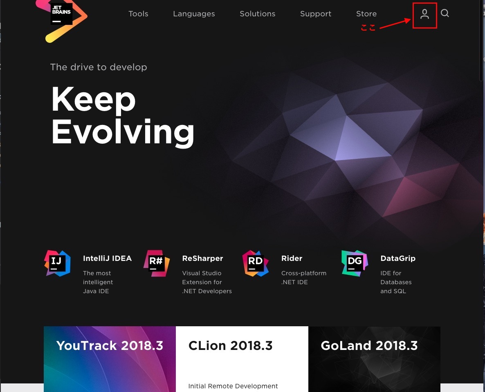
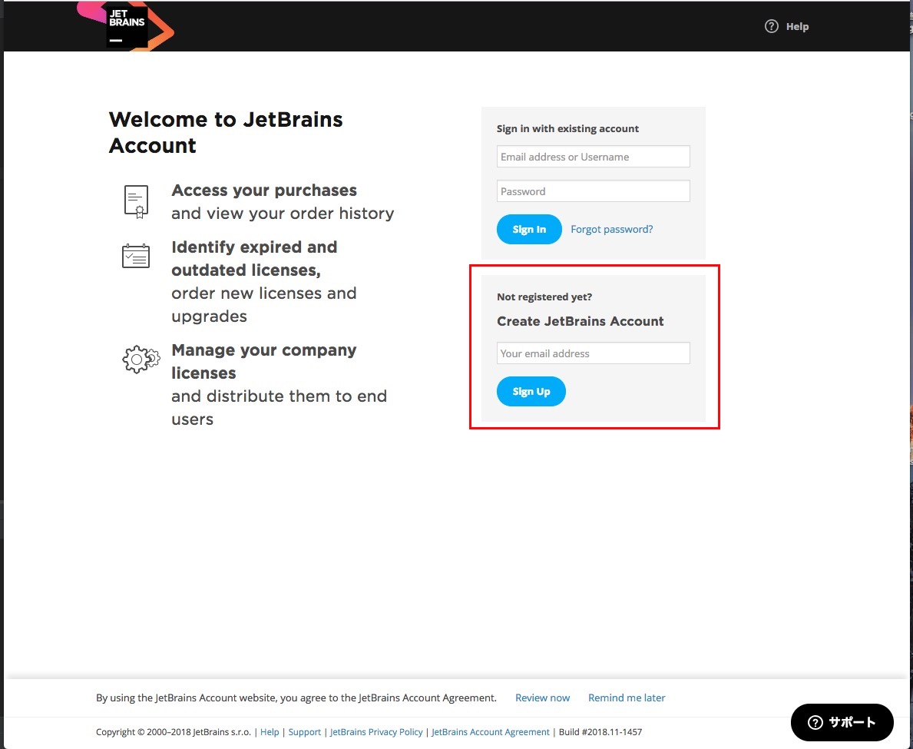
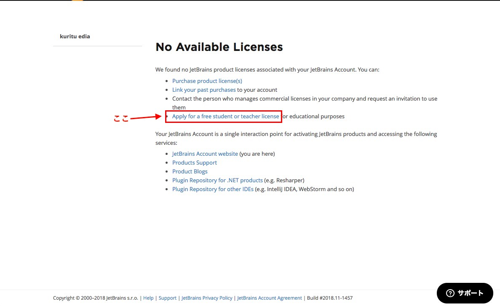
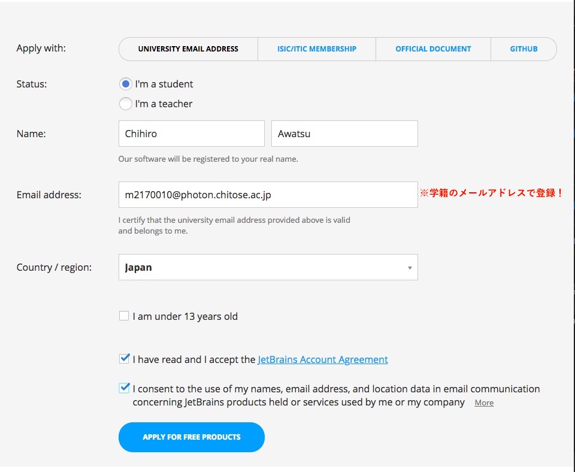
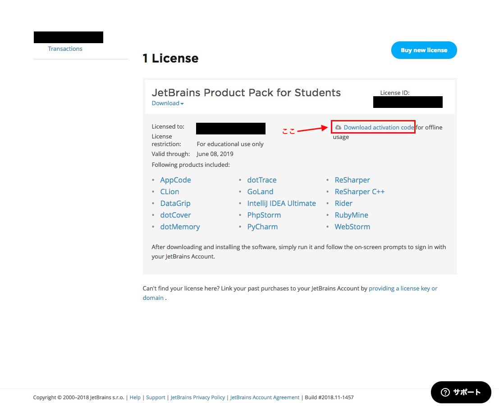
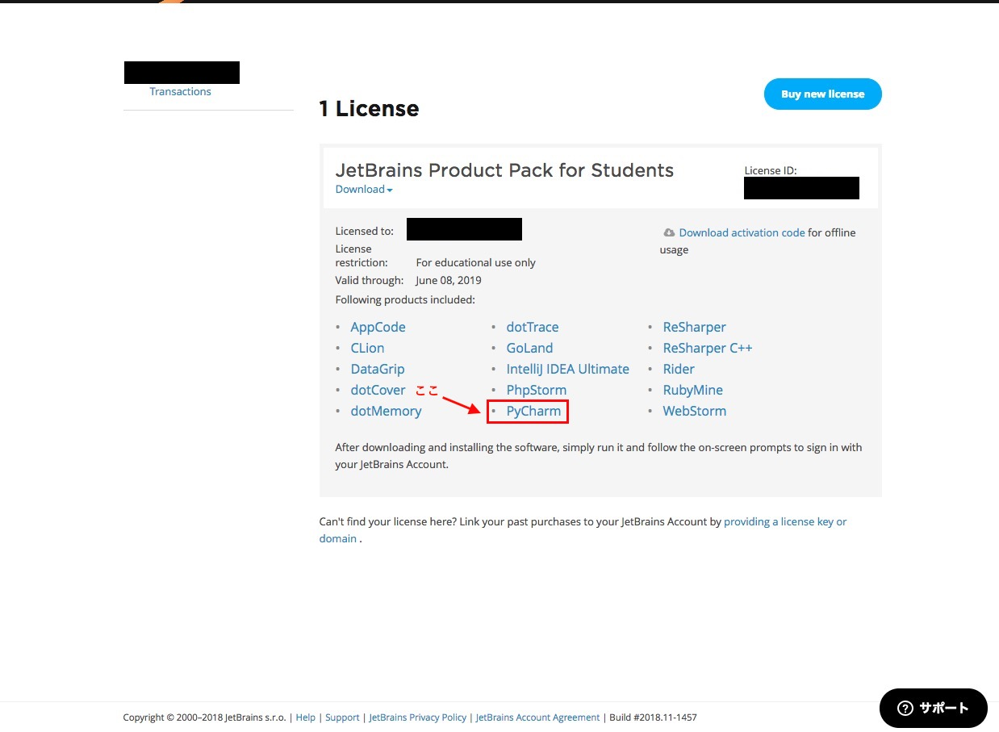
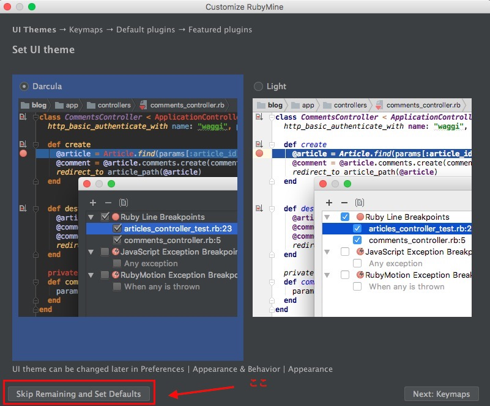

## HandsOn01 環境設定をしよう

### 共通の手順でインストールするもの
- Pycharm
  
1. [JetBrains](https://www.jetbrains.com)にユーザー登録  
    1. 下の画像右上の赤枠内のアイコンをクリック  
      
          
        
    2. 下の画像の赤枠内のフォームにメールアドレスを入力し「sign Up」ボタンをクリック  
        
        
      
    3. 入力したメールアドレスにJetBrainsからメールがくるのでメール内の「Confirm your account」をクリック  
      
    4. 名前などの情報を入力し、「submit」ボタンをクリック  
      
    5. 登録に成功すると下の画面に遷移するので赤枠内の「Apply for a free student or teacher license」をクリック  
    
          
      
    6. 遷移したページの真ん中あたりが下の画像のようになっているので「APPLY NOW」をクリック  
      
    7. 「UNIVERSITY EMAIL ADDRESS」タブに下の画像のように入力し「APPLY FOR FREE PRODUCTS」をクリック  

          

    8. 登録完了すると下の画面に遷移するので、赤枠内の「Download activation code」をクリックして、アクティベーションコードが書かれたファイルをダウンロードしてください。
    
          

    9. 次に、下の画面の赤枠内のPyCharmをクリックしてPyCharm本体をダウンロードしてください。
          

    10. ダウンロードしたアプリケーションを実行すると、下の画像のウィンドウが開くので画像の通りチェックをつけてOKをクリックしてください。
        
    
    11. 次に、下の画像のウィンドウが開くので画像左下の赤枠内にある「skip Remaining and Set Defaults」をクリックしてください。
        
    
    以上でPyCharmのインストールは完了です。  
    これ以降の項目はMacOSとWindowsで内容を分けているので該当する方を参照してください。
### MacOS
[Windowsの人はこっち](#Windows)  
##### インストールするもの
- HomeBrew
- Python3.6(使用するライブラリの関係上3.6にしています)
- pyenv
- pip

 

### Windows
[MacOSの人はこっち](#MacOS)
