## HandsOn01 必要なものをインストールしよう

### 共通の手順でインストールするもの
- Pycharm
  
1. [JetBrains](https://www.jetbrains.com)にユーザー登録  
    1. 下の画像右上の赤枠内のアイコンをクリック  
      
          
        
    2. 下の画像の赤枠内のフォームにメールアドレスを入力し「sign Up」ボタンをクリック  
        
        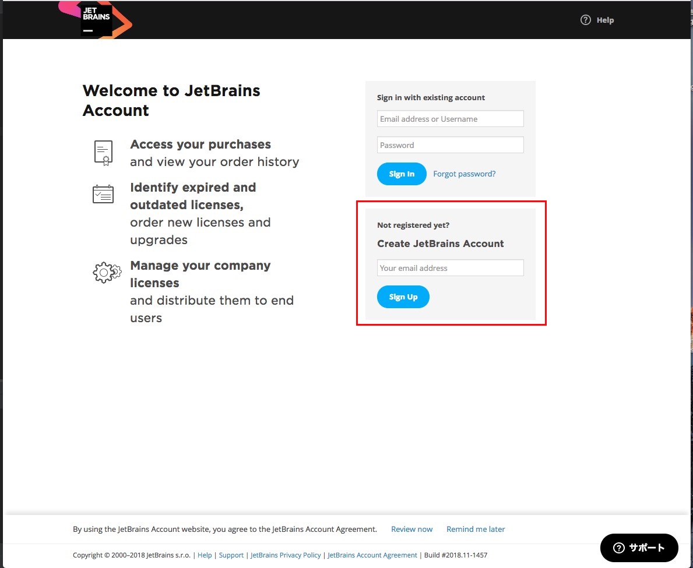
      
    3. 入力したメールアドレスにJetBrainsからメールがくるのでメール内の「Confirm your account」をクリック  
      
    4. 名前などの情報を入力し、「submit」ボタンをクリック  
      
    5. 登録に成功すると下の画面に遷移するので赤枠内の「Apply for a free student or teacher license」をクリック  
    
        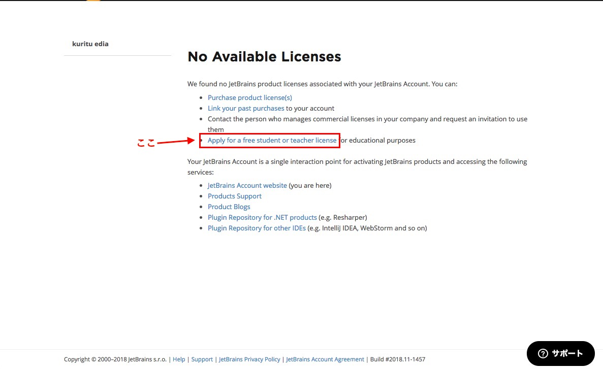  
      
    6. 遷移したページの真ん中あたりが下の画像のようになっているので「APPLY NOW」をクリック  
      
    7. 「UNIVERSITY EMAIL ADDRESS」タブに下の画像のように入力し「APPLY FOR FREE PRODUCTS」をクリック  

        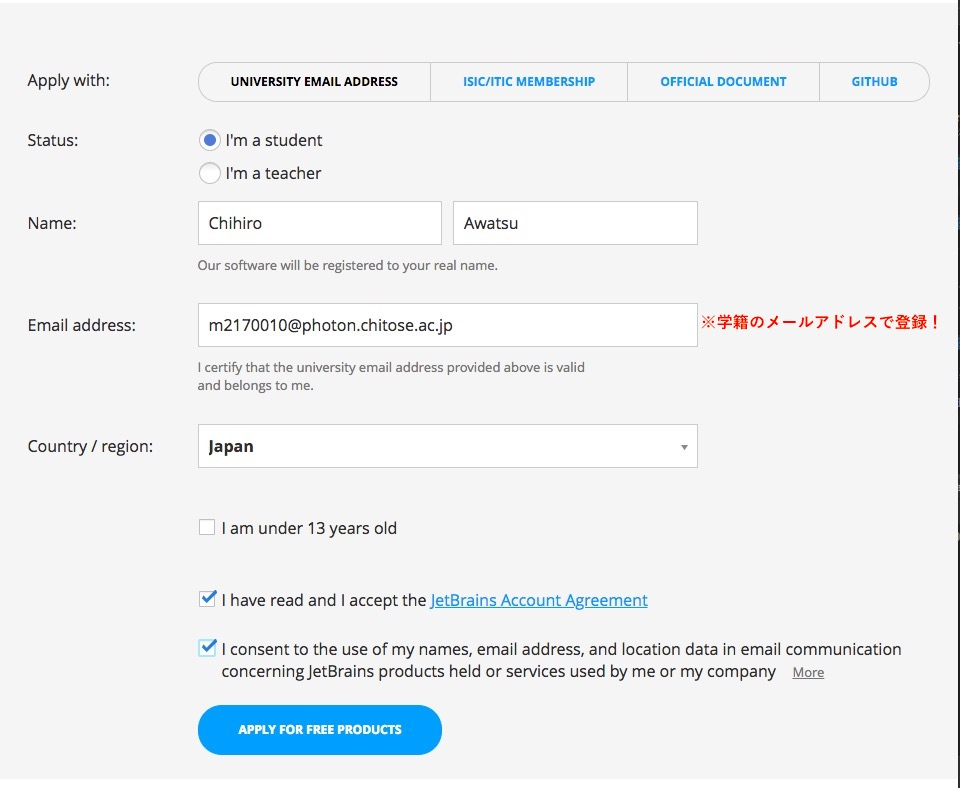  

    8. 登録完了すると下の画面に遷移するので、赤枠内の「Download activation code」をクリックして、アクティベーションコードが書かれたファイルをダウンロードしてください。
    
        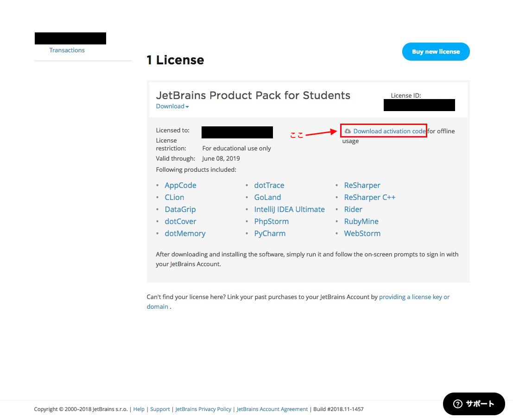  
        
2. Pycharmのインストール
    1. 次に、下の画面の赤枠内のPyCharmをクリックしてPyCharm本体をダウンロードしてください。
        
        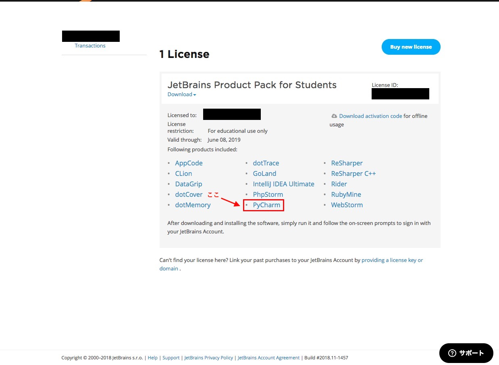  

    2. ダウンロードしたアプリケーションを実行すると、下の画像のウィンドウが開くので画像の通りチェックをつけてOKをクリックしてください。
        
        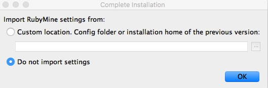
    
    3. 次に、下の画像のウィンドウが開くので画像左下の赤枠内にある「skip Remaining and Set Defaults」をクリックしてください。
        
        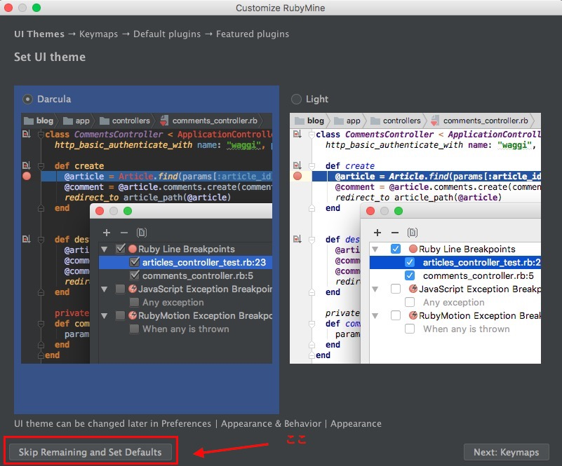
    
    以上でPyCharmのインストールは完了です。  
    これ以降の項目はMacOSとWindowsで内容を分けているので該当する方を参照してください。
### MacOS
[Windowsの人はこっち](#Windows)  
##### インストールするもの
- HomeBrew
- Python3.6.8(使用するライブラリの関係上3.7系ではなく3.6系にしています)
- pyenv
- pip

1. HomeBrew  
HomeBrewはMacOS用のパッケージマネージャーです。  
HomeBrewを使うとプログラミング言語やコマンドのインストール, ものによってはソフトウェアの管理にも使えます。  
   1. xcodeのCommand Line Toolsが必要なので以下のコマンドを実行してください(容量が結構必要です)  
      ```xcode-select --install```  
    
      以下のエラーが出た人はすでにインストール済みなので飛ばして大丈夫です。  
      ```xcode-select: error: command line tools are already installed, use "Software Update" to install updates```
    
   2. [HomeBrew](https://brew.sh/index_ja)にアクセスしてください
    
   3. 下の画像の赤枠内のコマンドをコピーしてターミナルで実行してください  
      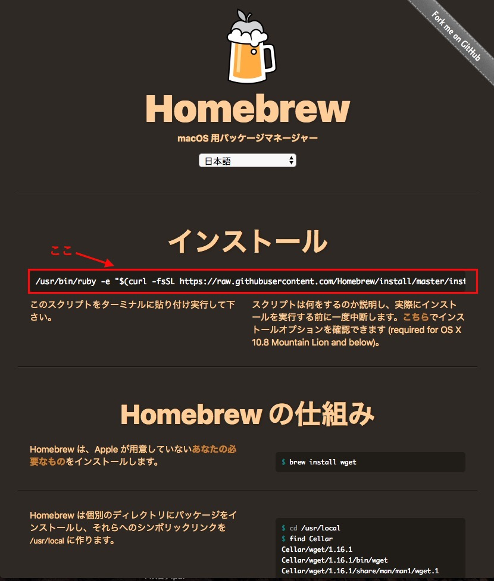  
    
   4. 以下のコマンドを実行してHomeBrewのversion番号が```Homebrew 2.0.1```のように表示されればインストール完了です。  
        ```brew --version```   
 
2. Python3.6.8, pyenv, pip  
MacではいくつかPython用のバージョン管理ツール, パッケージ管理ツールがあります。ここでは, 個人的に使いやすいpyenvとpipでやります。  
pyenvはPythonのバージョン管理ツールで, pipはパッケージ管理ツールです。  
まずpyenvのインストールを行います。  

   1. 以下のコマンドを順に入力  
        ```
        brew install pyenv  
        echo 'export PYENV_ROOT="$HOME/.pyenv"' >> ~/.bash_profile  
        echo 'export PATH="$PYENV_ROOT/bin:$PATH"' >> ~/.bash_profile  
        echo 'eval "$(pyenv init -)"' >> ~/.bash_profile  
        ```  

        2行目のコマンドで```no such file or directory .bash_profile```とエラーが出た人は先に以下のコマンドを実行して, その後もう一度手順iのコマンドを実行してください。  
        ```touch ~/.bash_profile```  
    
   2. 以下のコマンドを実行してpyenvのversion番号が```pyenv 1.2.9```のように表示されればインストール完了です。  
        ```pyenv --version```  
   
      次にpyenvを使ってPython3.6.8のインストールを行います。  
   3. 以下のコマンドを実行してください。(Python3.6.8がインストールされる)  
        ```PYTHON_CONFIGURE_OPTS="--enable-framework" pyenv install 3.6.8```  
   
   4. 以下のコマンドを実行してください。(MacOS上で利用されるPythonのversionを3.6.8に統一)  
        ```pyenv global 3.6.8```  
      
      次にpipのupgradeを行います。pipはPythonに付属してきますがPythonのインストール直後はバージョンが古いのでupgradeを行う必要があります。
   
   5. 以下のコマンドを実行してください。(pipをupgrade)  
      ```pip install --upgrade pip```
   
      
### Windows
[MacOSの人はこっち](#MacOS)
##### インストールするもの
- Python3.6.8

Python公式サイトでは、64bit版Windows用のPythonと、32bit版Windows用のPythonがあるので各々自分のPCのbit数を[確認手順](https://support.microsoft.com/ja-jp/help/958406  
)で確認しておいてください  

### インストーラーのダウンロード
[DLサイト](https://www.python.org/downloads/)から使いたいVerのインストーラーをダウンロードしに行く  
今回はPythonのverは3.6.8を選択する(画像は3.7.2になってますが3.6.8を選ぶだけで手順自体は同じです)  

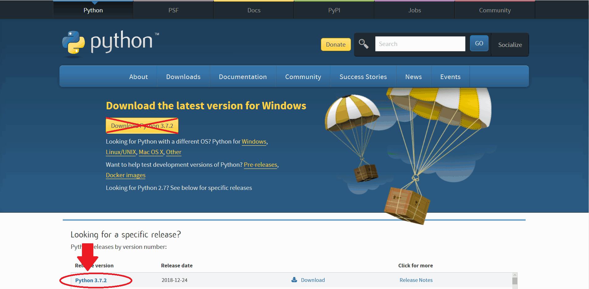

真ん中にある**Download Python ×.×.×**ではなく  
下にあるものをクリックしてください

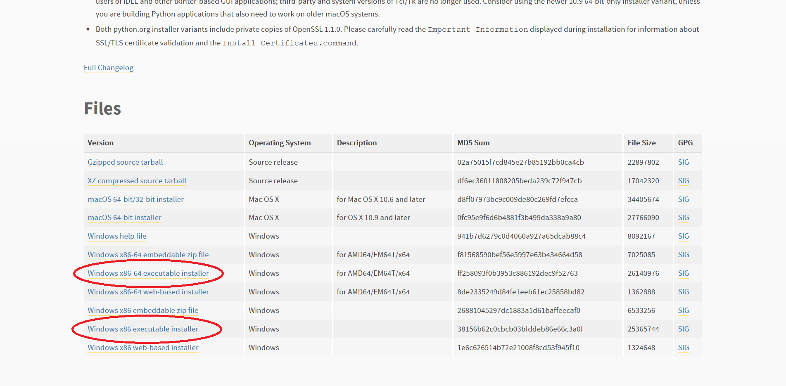
64bit版Windowsにインストールするなら  
**Windows x86-64 executable installer**  
32bit版なら  
**Windows x86 executable installer**  
をダウンロード  

### インストーラーの実行
ダウンロードしたものを実行します  

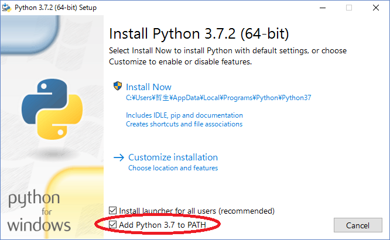

1. **"Add Python 3.x to PATH"** をチェック  
addにチェックをつけることで手動でPATHを通す必要がなくなります  
2. Install now をクリックしてインストールを開始します  
つつがなくインストールが終われば終了です

