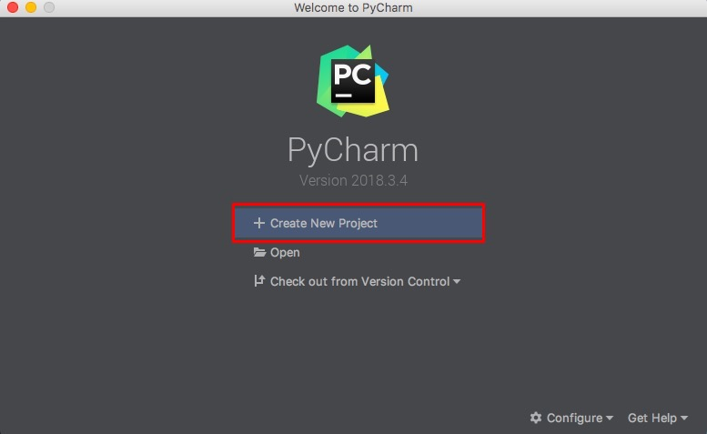
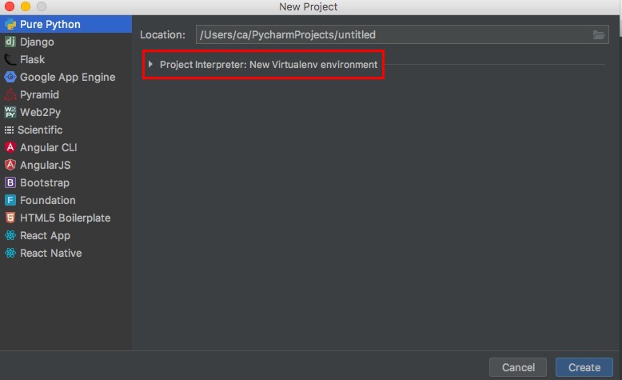
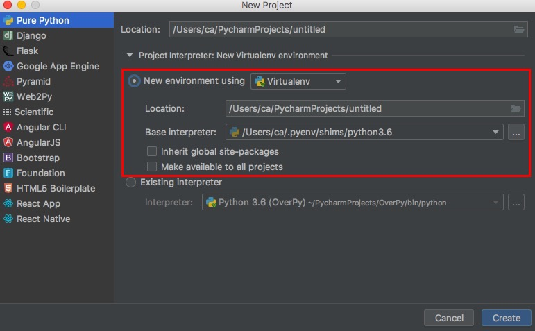

## PyCharmの設定をしよう

HandsOn02では, 実際にPyCharm上でプロジェクトを作成し, HandsOn01でインストールしたPython3.6を使えるように設定します。  

1. PyCharmを起動して下の画像の赤枠内の「Create New Project」をクリック  
  

2. 左側の選択が「Pure Python」になっていることを確認してから, 赤枠内の「▷」をクリック  
  

3. 赤枠内の「New environment using」で「virtual env」を指定し, 「Base Interpreter」欄にPythonのインストールパスを入力  
  
(この画像のPython3.6のインストールパスはMacでのパスなのでWindowsの人は注意してください)  

4. 「Location」欄をいじってプロジェクトに名前をつけたら右下の「Create」ボタンをクリック
