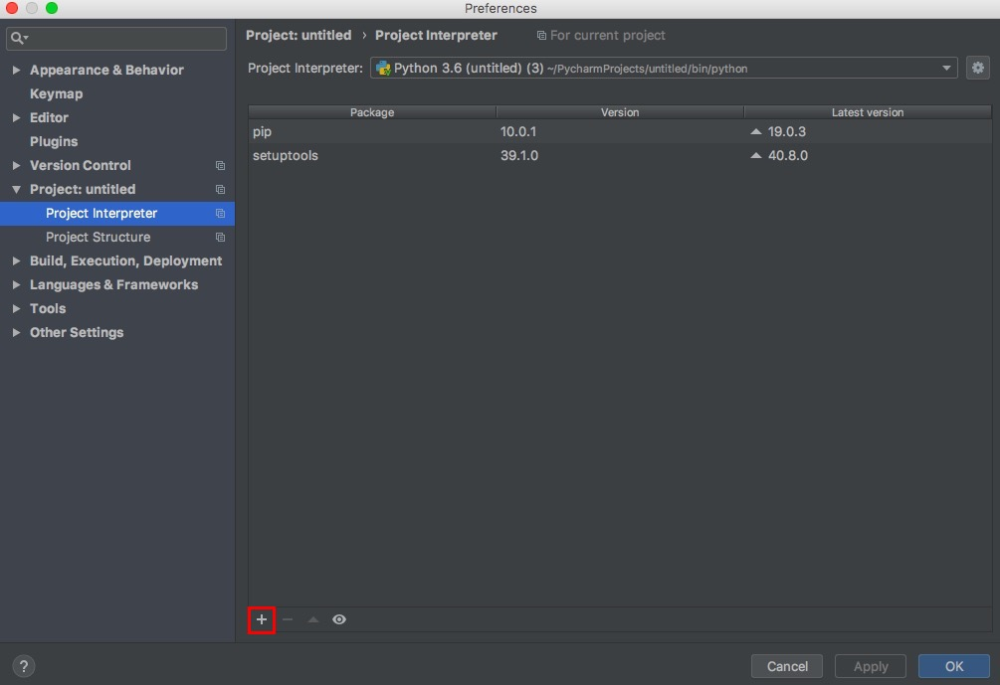
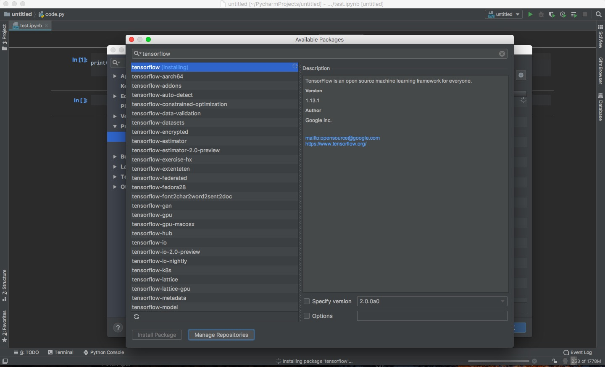

## PyCharmの設定をしよう

HandsOn02では, 実際にPyCharm上でプロジェクトを作成し, HandsOn01でインストールしたPython3.6を使えるように設定します。  

### プロジェクト作成編  
1. PyCharmを起動して下の画像の赤枠内の「Create New Project」をクリック  
  

2. 左側の選択が「Pure Python」になっていることを確認してから, 赤枠内の「▷」をクリック  
  

3. 赤枠内の「New environment using」で「Virtualenv」を指定し, 「Base Interpreter」欄にPythonのインストールパスを入力  
  
(この画像のPython3.6のインストールパスはMacでのパスなのでWindowsの人は注意してください)  

4. 「Location」欄をいじってプロジェクトに名前をつけたら右下の「Create」ボタンをクリック

### ライブラリ設定編
**画面はMacですが2の手順からは共通です**  
  
1. 以下の画像の赤枠内の「Preferences...」をクリック  
  

2. 以下の画像の赤枠内の「Project:プロジェクト名」をクリック  
  

3. 以下の画像の赤枠内の「Project interpreter」をクリック  
  

4. 以下の画像の赤枠内の「+」ボタンをクリック  
  

5. 以下の画像の赤枠内の検索欄にinstallしたいライブラリ名を入力（今回はtensorFlow）

6. 以下の画像の赤枠内の「Install Package」をクリック  
  

7. 以下の画像のようにライブラリ名(installing)のようになっていればインストールが進んでいます。  
インストールが完了したライブラリは青文字で表示されます。
